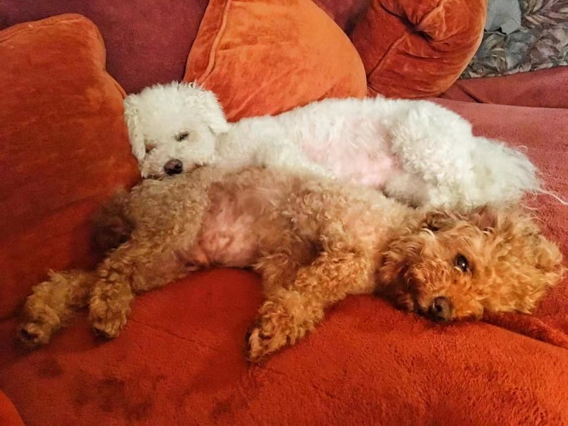

Back in 2008, I started a travel blog which I called [the Scublog](http://scubaolympics.blogspot.com/) (my nickname in high school was "Scuba") to document my time volunteering at the Beijing Summer Olympics.
I picked it back up in 2010 when I went across Europe on vacation prior to returning to China to teach English for a couple years (and also getting married, which wasn't part of the original plan).
Susu recently stumbled across the old blog and found it amusing -- even if some of the photos have been lost to to the wilderness of the ancient internet -- and reminded me that I really liked blogging!

In particular, I liked what I did in [this post](http://scubaolympics.blogspot.com/2011/08/restarting-scublog.html), where I laid out an ambitious set of potential post topics.
I certainly didn't do everything (dressing like an orc and visiting the World of Warcraft theme park somehow made the list), much less blog about it all.
But it did make me excited to go out, explore, and share my experiences.
Over the final 5 months of the blog, from August 2011 to January 2012 (right before I proposed to Susu), I consistently wrote a few articles per month describing the travel, food, and little absurdities that defined my life at that time.

Nearly eight years later, my life has completely changed: I got married, got my master's and doctorate in biostatistics, got two dogs, and moved to Baltimore.
We don't travel as much as we used to, but there are plenty of things going on around town (Baltimore is [quirky](https://www.kineticbaltimore.com/KSR/2019/)) that I could write about.
Our dogs are photogenic enough to include them on here when the occasion calls for it.

And since I'm kinda a stats expert now (I think I've earned the right to brag about it), I'd like to try to pose some interesting questions and approach them statistically.
I'll be as entertaining as I can be, and will only get technical/theoretical if I can do it without boring people.
Here's my new ambitious list of topics:

  * All things sports! Sports are great since (many) questions can be answered within a closed system with fixed rules. I like thinking about how much value players add to their team (and which players are more valuable than they appear) as well as probabilities of victory in a given situation. But more specific questions are also be interesting: Why are lefty pitchers better against lefty hitters? When basketball players move faster, are they being more productive or getting out of control?
  * Maps! I love maps. They are super important (defining borders is a major international issue!), but also more complex that they look. When displaying data on a map, we are just looking at a snapshot, and often without the underlying uncertainty... which can be huge! I'll try to come up with some fun map topics to write about.
  * Voting methods! I'm a fan of Score Voting (aka [range voting](https://rangevoting.org)) where each voter scores each candidate in each race on a scale (i.e. 1-5 or A-F). This is flexible for voters who have a lot of information (and may prefer to rank candidates) or voters who only know one candidate... or none of the candidates! I have a few simulation ideas to see which voting methods perform best under different distributions of voter knowledge.
  * Transportation. I like thinking about ways to promote public transportation or making cars more efficient. Hopefully I can come up with something good enough to feature on [CityLab](https://www.citylab.com)!
  * Public health! Since I spend every day reading, researching, and writing about public health (mostly infectious diseases), I'll pass on interesting tidbits and side analyses whenever possible. Kind of crazy how many side analyses I do on each project that aren't big enough to be their own paper, but may make a nice blog post.
  
These topics are much broader than my list on the Scublog, but I think it's a good place to start.
I'm glad to be back!
